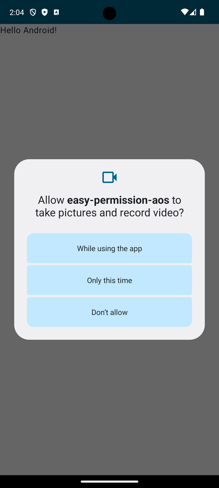

# EasyPermission

EasyPermission은 앱개발마다 매번 권한코드 작성하는게 귀찮아서 만든 라이브러리 입니다
onStart에서 등록만하고 쓰고싶은 곳에서 사용하면 됩니다. 사용하기 정말 편하게 만들었어요

## 권한


## 기능

- 안드로이드 프로젝트에 쉽게 통합
- 권한 요청을 위한 간단한 API 제공
- 허용 및 거부된 권한을 처리하기 위한 콜백 메커니즘

## 설치

`build.gradle` 파일에 다음 의존성을 추가하세요:

```groovy
repositories {
        google()
        mavenCentral()
        maven {
            url = uri("https://maven.pkg.github.com/kmwdevelop/easy-permission-aos")
            credentials {
                username = "kmwdevelop"
                password = "****" // 이메일로 연락 주세요. 읽기전용 토큰을 발급 해드립니다
            }
        }
    }

dependencies {
    implementation 'kr.co.kmwdev:easy-permission-aos:1.0.0'
}
```

## 사용법

EasyPermission 라이브러리를 사용하려면 다음 단계를 따르세요:

1. **Permission Launcher 등록:**

    `Activity` 또는 `Fragment`에서 `onStart` 메소드 내에 권한 런처를 등록합니다.

    ```kotlin
    override fun onStart() {
        super.onStart()

        // 권한 런처 등록
        EasyPermission.registerPermissionLauncher(this)
    }
    ```

2. **권한 요청 실행:**

    필요한 권한을 요청하려면 `launchPermissions` 메소드를 사용합니다.

    ```kotlin
    EasyPermission.launchPermissions(
        arrayOf(
            android.Manifest.permission.CAMERA,
            android.Manifest.permission.READ_EXTERNAL_STORAGE,
            android.Manifest.permission.WRITE_EXTERNAL_STORAGE
        )
    ) { permissions ->
        permissions.forEach { p ->
            if (p.value) {
                Log.d("EasyPermission", "Permission Granted: ${p.key}")
            } else {
                Log.e("EasyPermission", "Permission Denied: ${p.key}")
            }
        }
    }
    ```

### 전체 예제

다음은 `Activity`에서 EasyPermission을 통합하는 전체 예제입니다:

```kotlin
import android.os.Bundle
import android.util.Log
import androidx.appcompat.app.AppCompatActivity

class MainActivity : AppCompatActivity() {

    override fun onStart() {
        super.onStart()

        // 권한 런처 등록
        EasyPermission.registerPermissionLauncher(this)

        // 권한 요청 실행
        EasyPermission.launchPermissions(
            arrayOf(
                android.Manifest.permission.CAMERA,
                android.Manifest.permission.READ_EXTERNAL_STORAGE,
                android.Manifest.permission.WRITE_EXTERNAL_STORAGE
            )
        ) { permissions ->
            permissions.forEach { p ->
                if (p.value) {
                    Log.d("EasyPermission", "Permission Granted: ${p.key}")
                } else {
                    Log.e("EasyPermission", "Permission Denied: ${p.key}")
                }
            }
        }
    }
}
```

## 기여

기여는 언제나 환영입니다! GitHub에서 이슈를 열거나 풀 리퀘스트를 제출해 주세요.


프로젝트의 세부 사항과 선호도에 맞게 각 섹션을 수정해 주세요.
